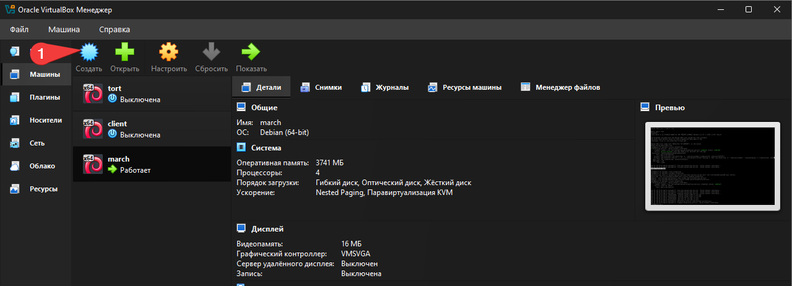
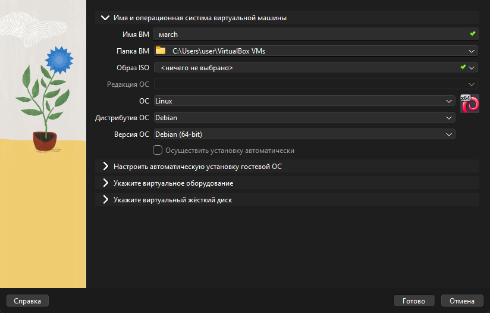
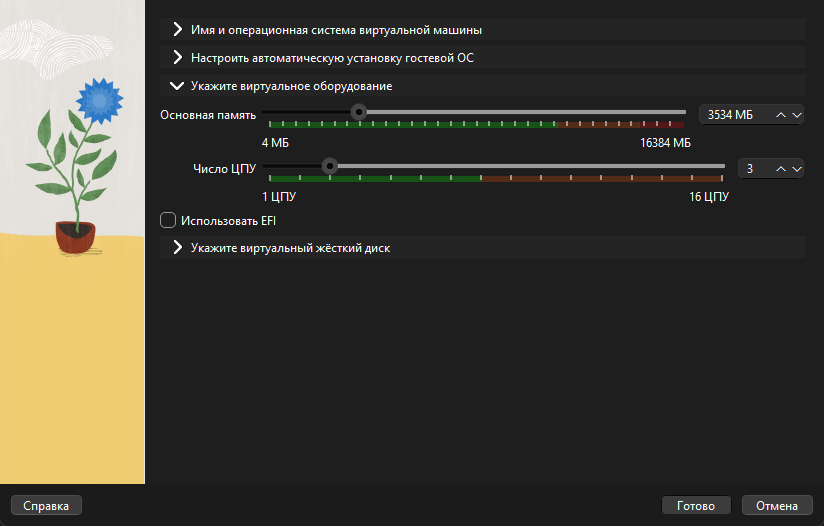
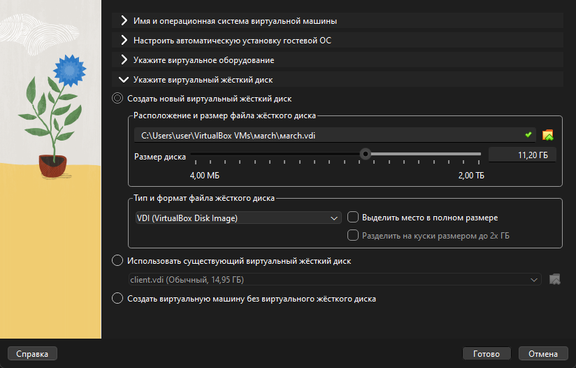
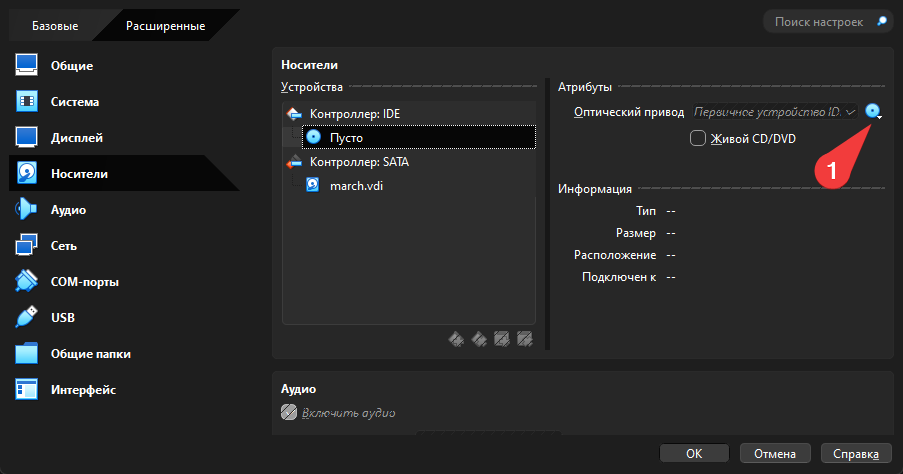

# DIY маршрутизатор
**!!!!!!!!!!!!!работа выполнена как итоговый учебный проект для лицйея №129. в данный момент проект все еще в разработке!!!!!!!!!!!!**
## шаг 1: Создание виртуального маршрутизатора
### подготовка
сначала нам нужно скачать iso-файл debian 13 и vb c сайтов:
-  [https://www.debian.org/download](https://www.debian.org/download)
-  [https://www.oracle.com/virtualization/technologies/vm/downloads/virtualbox-downloads.html?source=:ow:o:p:nav:mmddyyVirtualBoxHero&intcmp=:ow:o:p:nav:mmddyyVirtualBoxHero](https://www.oracle.com/virtualization/technologies/vm/downloads/virtualbox-downloads.html?source=:ow:o:p:nav:mmddyyVirtualBoxHero&intcmp=:ow:o:p:nav:mmddyyVirtualBoxHero)
после этого установите vb в удобное место и запустите.
далее сделайте следующие шаги для создания первой машины в вб, которая будет маршрутизатором:
1. 
2. 
3. установите ресурсов пк вы готовы выделить для машины
4. 
5. нажмите кнопку "готово".

### шаг 2: установка и настройка маршрутизатора
1. откройте настройки созданой машины
2. откройте раздел "носители"
3. нажмите на "пусто"
4. нажмите на значек жесткого диска справа
5. нажмите "выбрать файл диска", перейдите в место куда установился файл и выберите его
6. запустите машину
7. выберите графическую установку
8. выберите язык
9. имя компьютера - march
   имя домена пропустите(ничего не вписывайте)
   пароль для суперпользователя выберите любой
   имя второго пользователя без супер-прав - user
   имя пользователя под которым вы будете известным в системе оставьте таким же
   напишите пароль для второго пользователя
10. выберите "авто - использовать весь диск"
11. выберите предложенный диск
12. выберите "все файлы в одном месте"
13. выберите "Закончить разметку и записать изменения на диск"
14. записать изменения на диск: да
15. просканировать дополнительные установочные устройства: нет
16. выберите "российская федерация"
17. выберите "deb.debian.com"
18. информация о http-прокси пропустите(ничего не вписывайте)
19. участвовать в опросе популярности пакетов: как хотите
20. при выборе программного обеспечения выберите только ssh-сервер и стандартные системные утилиты
21. установить системный загрузчик grub на первичный диск: нет
22. устройство для установки системного загрузчика: выберите тот, который уже существует.
23. ждите пока машины запустится а затем выключите ее(нажмите на "машина" сверху, а потом "завершить работу")


после установки машина должна сама завестить. входим в систему и выполняем `apt update` и `apt install systemd-resolved` чтобы установить недостающий пакет.
после этого выключаем машину и выполняем действия:
1. откройте настройки машины 
2. перейдите в раздел "сеть"
3. включите первый адаптер
   тип подключения "сетевой мост"
   таким образом мы создадим виртуальную сетевую карту для устройства и оно станет таким же полноправной часть сети как и ваш компьютер
4. включите второй адаптер
   выберите тип подключения - внутренняя сеть
   таким образом мы создали виртуальную локальную сеть в виртуальной среде в которой будет находиться наши клиенты
5. выключите все другие адаптеры если они включены

существует два сервиса для настройки сети ifupdown и systemd-network.
мы будем использовать только второй вариант так как он более современный.

## Шаг 2: Настройка сетевых интерфейсов Маршрутизатора
### настройка WAN интерфейса
1. отключим конфликтующий сервис при помощи `systemctl stop networking` и `systemctl mask networking`
2. `nano /etc/systemd/network/20-wan.network`
3. в открывшемся окне пишем:
   `[Match]`
   `Name=enp0s3`
   `[Network]`
   `DHCP=yes`
   таким образом мы настроили WAN. теперь он выполняет функцию DHCP-сервера, а ip адрес назначается автоматически
4. нажмите `Ctrl+X` затем `Y`,ентер чтобы сохранить и выйти
### настройка LAN интерфейса
1. `nano /etc/systemd/network/10-lan.network`
2. в открывшемся окне пишем:
   `[Match]`
   `Name=enp0s8`
   `[Network]`
   `Address=192.168.50.1/24`
   таким образом мы настроили LAN. мы указали самостоятельно какой у него будет ip
3. сохраняем и выходим из этого окна

### настройка  DNS и запуска сервисов
1. Удаляем старый файл DNS
   `rm /etc/resolv.conf`
2. Создаем ссылку на новый системный файл DNS
   `ln -sf /run/systemd/resolve/stub-resolv.conf /etc/resolv.conf`
3. Включаем и запускаем сервис сети
   `systemctl enable --now systemd-networkd`
4. Включаем и запускаем сервис DNS
   `systemctl enable --now systemd-resolved`

### проверка сетевых настроек
теперь для проверки вводим команду `networkctl status`. Вы должны увидеть список интерфейсов со статусом `configured` или `routable` (зеленым цветом).
Проверьте IP-адреса и выполните `ip a`
Убедитесь, что:
- `enp0s3`имеет адрес от провайдера (например, 192.168.1.x или 10.x.x.x).
- `enp0s8`имеет адрес`192.168.50.1`
## шаг 3: Включение маршрутизации и NAT
На данном этапе у нас есть сервер с двумя сетевыми картами, но они работают изолированно. Пакеты из внутренней сети (LAN) доходят до роутера и "умирают", потому что роутер не знает, что их нужно пересылать дальше, а внешний мир не знает о существовании вашей внутренней сети.
### Включение пересылки пакетов
Нужно разрешить ядру Linux перекладывать пакеты с одного интерфейса на другой.
- **1 способ**:
  1. Откройте файл системных настроек:
     `nano /etc/sysctl.conf`
  2. напишите сточку:
     `net.ipv4.ip_forward=1`
  3. сохраните файл
  4. Примените изменения при помощи команды:
     sysctl -p
     _Если в ответ вывелась строчка `net.ipv4.ip_forward = 1`, значит всё сработало._
- **2 способ**:
  1. Создайте отдельный конфигурационный файл:
     `nano /etc/sysctl.d/90-routing.conf`
  2. Впишите туда ту же самую строку:
     `net.ipv4.ip_forward=1`

**в чем различия способов?**
**1 способ**:
- `/etc/sysctl.conf` - место хранения команд.
- **Аналогия:** Представьте, что вы написали приказ на бумаге, но он лежит у вас на столе. Команда`sysctl -p`— это момент, когда вы берете этот приказ, идете в цех и громко зачитываете его рабочим. Они начинают исполнять его немедленно.
  суть: Обычно при включении компьютера специальная служба ищет этот файл и "зачитывает" его сама.
- **Проблема:** Если вы перезагрузите компьютер, "рабочие" (ядро) забудут приказ, потому что у них короткая память. Им нужно зачитать его снова при включении.
  
- `sysctl -p` - команда применения настроек
- **Суть:** Она заставляет ядро Linux прочитать файл **прямо сейчас** и применить настройки.
 - **Проблема:** Если вы перезагрузите компьютер, ядро забудет команду. И при включении нужно будет снова выполнить команду.
  
**2 способ**:
- **Аналогия:** Это специальная папка для "Важных приказов", которую система проверяет в последнюю очередь.
- **Цифра 90:** Имя файла начинается с цифры`90`. Система читает файлы по порядку: 10, 20... 90.
- **Суть:** Поскольку ваш файл загружается одним из последних (из-за цифры 90), он **гарантированно переписывает** любые стандартные настройки, которые могли бы выключить маршрутизацию.

**Итог**
- **Способ 1 (sysctl.conf):** Стандартный, но иногда дает сбой при автозагрузке в новых системах.
- **Способ 2 (sysctl.d/90...):** Модульный, современный и "железобетонный" для автозагрузки.
- **Команда`sysctl -p`:** Нужна в обоих случаях, чтобы применить настройки **прямо сейчас**, не дожидаясь перезагрузки компьютера.
### Установка и настройка NFTables (NAT)
Теперь настроим маскировку (NAT). Это заставит роутер подменять адреса пакетов, исходящих от юзеров, на свой собственный внешний адрес.

1. Установите пакет (обычно он есть, но проверим):
```
apt update && apt install nftables
```

2. Откройте файл конфигурации фаервола. Внимание: мы полностью заменим его содержимое на нашу простую конфигурацию.
```
nano /etc/nftables.conf
```

3. Удалите всё, что там есть (можно зажать`Ctrl+K`, чтобы удалять строки), и вставьте следующий текст. **Важно:** В строке`oifname`укажите имя вашего **WAN** интерфейса (тот, что смотрит в интернет, например`enp0s3`).
```
#!/usr/sbin/nft -f

flush ruleset

table ip nat {
   chain postrouting {
	   type nat hook postrouting priority 100;
	   oifname "enp0s3" masquerade
	}
}
```
_Разбор:_ Мы создали таблицу `nat`, цепочку `postrouting` (после маршрутизации) и правило: "всё, что уходит через интерфейс `enp0s3`, маскировать".

### Запуск фаервола
  1. Включите автозагрузку и запустите службу:
```
systemctl enable --now nftables
```

2. Проверьте, что правила загрузились:
```
nft list ruleset
```
Вы должны увидеть ту конфигурацию, которую только что написали.
### Итог шага 3
Теперь ваш Debian официально стал маршрутизатором.
- Он умеет пересылать пакеты (`ip_forward`).
- Он умеет притворяться, что все запросы идут от него (`masquerade`).

## Шаг 4: Настройка DHCP и DNS
### Редактирование конфигурации LAN
Откройте файл настройки внутренней сети:
```bash
nano /etc/systemd/network/10-lan.network
```
### Включение DHCP-сервера

Сейчас файл выглядит так:
```ini
[Match]
Name=enp0s8

[Network]
Address=192.168.50.1/24
```

Вам нужно изменить его, добавив строку `DHCPServer=yes` в секцию `[Network]` и добавив новую секцию `[DHCPServer]` в конце.

Приведите файл к такому виду:

```ini
[Match]
Name=enp0s8

[Network]
Address=192.168.50.1/24
DHCPServer=yes

[DHCPServer]
PoolOffset=50
PoolSize=100
EmitDNS=yes
DNS=8.8.8.8
```

**Что значат эти строки:**
*   `DHCPServer=yes`: Включает раздачу адресов на этом интерфейсе.
*   `PoolOffset=50`: Раздавать адреса начиная с `...50` (то есть с 192.168.50.50).
*   `PoolSize=100`: Выдать максимум 100 адресов (до 192.168.50.150).
*   `DNS=8.8.8.8`: Сообщать клиентам, чтобы они использовали DNS от Google (это самый простой способ избежать проблем с настройкой DNS-прокси).

*Нажмите `Ctrl+O`, `Enter`, `Ctrl+X`.*

### Применение настроек
Перезапустите службу сети, чтобы изменения вступили в силу:
```bash
systemctl restart systemd-networkd
```
### Итог шага 4
Ваш роутер полностью готов!
1.  Он подключен к интернету.
2.  Он имеет адрес шлюза `192.168.50.1`.
3.  Он умеет пересылать пакеты и маскировать их (NAT).
4.  Он автоматически выдаст IP-адрес и настройки DNS любому устройству, которое подключится к внутренней сети.

## Шаг 5: Создание виртуальных клиентов

На этом этапе мы создадим "потребителей" интернета. Это будут виртуальные машины, которые ничего не знают о реальном мире, а видят только ваш виртуальный роутер.

Вам нужно создать две такие машины. Я опишу процесс для одной, вторую вы сделаете по аналогии (или клонированием).

**Важно:** Не выключайте виртуальную машину **Router**! Она должна работать, чтобы выдавать IP-адреса новым машинам прямо во время их установки.

### Создание виртуального клиента

1.  В VirtualBox нажмите **"Создать"**.
2.  **Имя:** `Debian-Client-1`.
3.  **Тип/Версия:** Linux / Debian (64-bit).
4.  **Ресурсы:** 1 ГБ ОЗУ, 1 ядро ЦП.
5.  **Диск:** (10-15 ГБ).

### Настройка сети (Самое важное)

Пока машина выключена, идем в **Настройки -> Сеть**.

1.  **Адаптер 1:**
    *   Включить: **Да**.
    *   Тип подключения: **Внутренняя сеть (Internal Network)**.
    *   **Имя:** Выберите из списка то же самое имя, которое вы задали для LAN-адаптера роутера (например, `router_lab` или `intnet`).
    *   *Логика:* Мы втыкаем виртуальный кабель от этого клиента в виртуальный свитч, куда воткнут LAN-порт роутера.

2.  **Адаптер 2, 3, 4:** Должны быть выключены. Клиенту нужна только одна сетевая карта.

### Установка Debian 13

Запустите машину `Debian-Client-1` и выберите ISO-образ Debian.

1.  **Start Installation:** Начните обычную установку.
2.  **Настройка сети (Магия):**
    *   В момент, когда установщик дойдет до шага "Configuring the network with DHCP", произойдет интересное.
    *   Установщик пошлет запрос в сеть.
    *   Ваш **Router** (который работает в фоне) поймает этот запрос и выдаст адрес (например, `192.168.50.50`).
    *   Если установка сети прошла успешно и установщик попросил ввести "Hostname", значит, **ваш роутер работает!**
3.  **Завершение установки:**
    *   Hostname: `client-1`.
    *   Пароли: как обычно.
    *   Разметка диска: весь диск, один раздел.
    *   **Выбор ПО:** Снимаем галочки с графики (GNOME и т.д.), оставляем только **Standard system utilities**. (SSH можно не ставить, если не планируете управлять клиентом удаленно, но лучше поставить).

### Второй клиент

Повторите те же действия для второй машины `Debian-Client-2`.
*   Единственное отличие — имя хоста (`client-2`) при установке.

### Альтернатива (Клонирование)
Если лень устанавливать второй раз:
1.  Выключите `Debian-Client-1` после установки.
2.  Нажмите на неё правой кнопкой -> **Клонировать**.
3.  Имя: `Debian-Client-2`.
4.  MAC Address Policy: **Generate new MAC addresses for all network adapters** (Обязательно выберите это, иначе у них будут одинаковые "физические" адреса и сеть заглючит).
5.  Тип клонирования: **Full clone** (Полное клонирование).

## Этап 6: Проверка и Тестирование
Сейчас мы проверим, работает ли ваша виртуальная лаборатория как настоящая сеть.

Убедитесь, что запущены все три машины: **march**, **Client-1** и **Client-2**.

Все проверки будем выполнять **на машине Client-1** (или Client-2). Войдите в систему под своим пользователем.

### Тест 1: Проверка получения IP-адреса (Работает ли DHCP?)

## Введите команду:

```
ip a
```

**Что искать:** Посмотрите на интерфейс `enp0s3` (на клиенте он будет первым и единственным).

- Вы должны увидеть строку`inet 192.168.50.xxx ...`.
- Если адрес начинается на`192.168.50...`, значит, DHCP-сервер на роутере сработал и выдал адрес. Отлично!

### Тест 2: Связь с Роутером (Работает ли локальная сеть?)

Попробуем "пропинговать" шлюз (наш роутер).

## Введите команду:

```
ping 192.168.50.1 -c 4
```

**Результат:**

- Если вы видите строки`64 bytes from 192.168.50.1...`— связь с роутером есть.
- Если`Destination Host Unreachable` или `100% packet loss`— проблема с настройкой внутренней сети VirtualBox (проверьте имена сетей в настройках адаптеров).

### Тест 3: Выход в Интернет по IP (Работает ли NAT?)

Теперь самое интересное. Попробуем достучаться до сервера Google по его IP-адресу. Это проверит, пересылает ли роутер пакеты наружу.

## Введите команду:

```
ping 8.8.8.8 -c 4
```

**Результат:**

- Успешные ответы означают, что **NAT настроен верно**. Пакет ушел от клиента -> на роутер -> замаскировался -> ушел в реальный интернет -> вернулся обратно.
- Если не работает — проверьте`sysctl`(ip_forward) или`nftables`на роутере.

### Тест 4: Работа DNS (Работает ли разрешение имен?)

Теперь проверим, можем ли мы открывать сайты по именам.

## Введите команду:

```
ping google.com -c 4
```

**Результат:**

- Если пинг пошел, значит, DNS-сервер (8.8.8.8), который мы прописали в настройках DHCP роутера, успешно передался клиенту.

### Тест 5: Общение между клиентами

Узнайте IP-адрес на **Client-2** (командой `ip a`), а затем попробуйте пропинговать его с **Client-1**.

```
ping 192.168.50.xxx -c 4
```

Они должны видеть друг друга, так как находятся в одной виртуальной комнате.

---

### 🎉 Финал

Если все 5 тестов прошли успешно — **поздравляю!**

Вы своими руками, без использования готовых решений вроде OpenWRT или MikroTik, собрали полноценный маршрутизатор на базе чистого Linux Debian 13.

### **Что вы построили:**

1. **WAN:** Получает интернет от провайдера.
2. **LAN:** Изолированная сеть`192.168.50.0/24`.
3. **Core:** Ядро Linux маршрутизирует трафик.
4. **Services:** Systemd-networkd автоматически управляет адресами и DNS.
5. **Security:** Nftables скрывает клиентов за одним адресом.

Теперь вы можете экспериментировать: настраивать фаервол, ограничивать доступ клиентам, анализировать трафик или даже поднять там VPN-сервер. Лаборатория готова.
